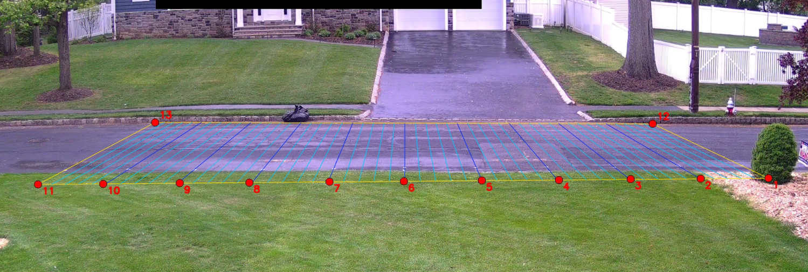
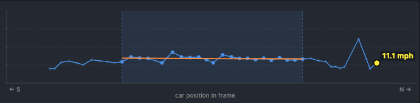

> Code: [github.com/leochen4891/camwatch](https://github.com/leochen4891/camwatch) 
> Live: [camwatch.leidevs.com](https://camwatch.leidevs.com/) (Cloudflare Access)

**TL;DR.** Replaced two virtual lines and a stopwatch with trajectory regression on homography-projected ground points. Same calibration effort, lane-independent results: mean absolute error 0.59 mph across nine known-speed drive-bys, with about 6× tighter lane-to-lane spread than the original 2-line method.

[The original camwatch post](https://leidevs.com/blog/camwatch/) covered building the service end-to-end. This is the rewrite of one piece of it: the speed engine.

## Beyond two lines

The original speed math is small and easy to explain. Pick two virtual lines on the road, time how long each car takes to traverse them, divide the calibrated distance by elapsed seconds. For cars that stay in their conventional lane, the answer is close enough.

What I wanted, though, was a measurement that holds up wherever a car happens to be on the road, not just the conventional lane. To probe the limits, I drove the same 25 mph past the camera in the near lane and the far lane. The reported numbers came out about 13 percentage points apart. Same speed, two answers, depending on lateral position.

That gap is geometric, not a calibration knob. The two-line method assumes the *projected length of the car's path between the two lines, in meters, is the same wherever the car drives*. That assumption only holds approximately, and the deviation grows with lateral position.

The path forward is a different abstraction.

## Homography: the right abstraction

A homography is a 3x3 matrix that maps points between two planes in projective space. For a camera looking down at a flat road, the homography from **pixel coordinates** to **road-plane meters** is exact (lens distortion on this Reolink is small enough to ignore). Once it is in hand, every detection's bbox bottom-center projects to a real `(X, Y)` in meters on the road. Speed is the magnitude of `dY/dt`, where `Y` is the road's long axis.

Once the coordinate system is metric and road-aligned, everything downstream gets simpler: per-frame instantaneous speed `v_inst = sqrt(ΔX² + ΔY²) / Δt`, a trajectory you can plot, a region of the road where measurement is most accurate, and a grid-based trigger that uses the same calibration as the speed math.

## Calibration: paint, then click

Before any code, the calibration is a physical artifact. I went out to the road with a tape measure and painted 13 white dots on the asphalt at exact known offsets:

- 4 corners of the calibration rectangle (NE, SE, NW, SW curbs)
- 9 along the east curb at exact 5-foot intervals (Y = +25 ft, +20 ft, ..., -20 ft, -25 ft, all at X = 0)

Each red dot in the image is a paint mark; clicking each one in a calibration frame gives 13 (pixel, meter) correspondences. The colored grid lines are the homography's projection of a 5-foot world-space grid back into the image: the visual sanity check that the fit lines up with reality.

Anchoring to physical, tape-measured marks means the Y-scale on the homography is grounded in real-world distance, not a guess at the camera's geometry. The 9 along-the-curb anchors fix the **scale of Y** absolutely, so reported speed does not depend on the (slightly less precise) road-width assumption. Then a single calibration frame, click each painted dot in the image, and `cv2.findHomography` solves least-squares over the 13 (pixel ↔ meters) correspondences.

## Per-frame physics

The speed pipeline becomes:

1. YOLO emits a bbox per frame.
2. Take the bbox bottom-center (where the car's wheels meet the road).
3. Project through `H` to get `(X, Y)` in meters.
4. Compute `v_inst` between consecutive frames, in mph.
5. Aggregate to a single reported speed by fitting a line to the projected `(Y, t)` trajectory over samples within ±15 ft of `Y = 0`, where the homography is most accurate. The slope of that line is the velocity. I'll call this **trajectory regression** for short.

### Ground-truth verification

I drove past the camera nine times at three known speeds, varying both direction and lane (including two wrong-way passes). For each pass, "truth" is the actual speed I held on the speedometer; "reported" is what camwatch wrote into the database.

| Truth | Direction × Lane | Reported | Error |
|---|---|---|---|
| 15 mph | S, west | 15.70 | +0.70 |
| 15 mph | N, east | 14.33 | −0.67 |
| 15 mph | S, east (wrong-way) | 15.38 | +0.38 |
| 15 mph | N, west (wrong-way) | 15.18 | +0.18 |
| 25 mph | S, west | 25.30 | +0.30 |
| 25 mph | N, east | 25.31 | +0.31 |
| 25 mph | S, west | 25.18 | +0.18 |
| 35 mph | N, east | 36.19 | +1.19 |
| 35 mph | S, west | 36.17 | +1.17 |

Mean absolute error: 0.59 mph. Max: 1.19 mph (at 35 mph). All four 15 mph passes, including both wrong-way ones, land within ±0.7 mph of truth. The reading does not depend on which lane the car is in.

### Improvement over the 2-line method

The original motivation for the rewrite was lane bias in the 2-line method. The clearest demonstration is a 4-way factorial at 15 mph: same target speed, both directions, both lanes (including the two "wrong-way" combinations the 2-line calibration never anticipated). I ran the 2-line crossing logic retroactively against each pass's recorded trajectory so we can compare both methods on identical data.

| Truth | Direction × Lane | 2-line method | Trajectory regression |
|---|---|---|---|
| 15 mph | S, west | 16.41 (+1.41) | 15.70 (+0.70) |
| 15 mph | N, east | 15.68 (+0.68) | 14.33 (−0.67) |
| 15 mph | S, east (wrong-way) | **21.01 (+6.01)** | 15.38 (+0.38) |
| 15 mph | N, west (wrong-way) | **12.78 (−2.22)** | 15.18 (+0.18) |

2-line spread across the four lanes: **8.23 mph** (12.78 → 21.01) at a constant 15 mph true speed. Trajectory regression spread: **1.37 mph** (14.33 → 15.70). About a 6× tighter band, with the lane-dependent gap gone.

The bold cells are exactly where the 2-line assumption breaks. The method uses a *direction-specific* calibrated distance: one number for "northbound traffic," another for "southbound." A car driving the conventional way fits that calibration. A southbound car in the east lane traverses the much shorter east-lane projection, but the formula still divides the southbound distance by the (correspondingly shorter) elapsed time, and the reported speed runs high. A northbound car in the west lane has the opposite problem and reads low. Trajectory regression sidesteps the question entirely: it measures the actual `Y` distance the car covered, regardless of which lane that path lived in.

## The UI: show your work

When the speed is "the slope of a line fitted to a subset of points," the UI can actually show that. Click any pass and you get:

- The recorded clip with the calibrated grid drawn on top
- A speed chart below: each detection plotted as a dot at `(u, v_inst)`
- Samples inside the regression window are full-color and slightly larger; the rest are dimmed
- A translucent shaded band marks the `u` range where the car was inside the window
- An orange best-fit line through only the highlighted points

A constant-speed pass produces a near-horizontal orange line and dots clustered tightly around it. A decelerating car produces a tilted orange line. A noisy detection shows up as one wild dot off the trend. If you want to second-guess the headline number, you can do it visually in three seconds.

## Triggering, also rebuilt

The two-line trigger is gone too. A "pass" is now: a tracked object whose ground-point projection enters the calibrated grid, then leaves it (or ages out while still inside).

For normal cars the recorded passes look identical to before. The improvement shows up at the edges:

- **Near-lane reach.** The old pixel ROI was tuned to the road as visible at calibration time, so a car whose bbox bottom-center landed a few pixels below it (e.g., a near-lane SUV) sometimes wouldn't register. The grid-based filter uses the same calibration as the speed pipeline, so the entire calibrated road is in scope by construction.
- **Parked-car robustness.** Bbox jitter on a parked car at the curb could occasionally satisfy the two-line crossing condition and produce a pass at an unrealistic speed. A stationary-track filter now ignores events from any track that has not actually moved.
- **Tighter clips.** When the tracker briefly loses a vehicle that is still in-frame, the old code would wait several seconds before triggering the recorder, leaving the clip with extra post-exit footage. The new recorder caps clip duration at the last in-grid frame, regardless of when the trigger eventually fires.

## Takeaways

1. **Picking the right abstraction is upstream of everything.** I spent an hour adding per-direction correction factors to the two-line method before stepping back. Each factor improved one lane's numbers and shifted another's. That pattern was the signal: the lane-dependent reading wasn't a bug to be patched, it was the abstraction reaching its natural ceiling. Recognizing that took backing out of the local optimization and looking at the shape of the error.
2. **A good UI for showing the work pays back its cost on day one.** Once the chart could show which samples produced the headline number, every speed reading became falsifiable in three seconds of looking.

Code: [github.com/leochen4891/camwatch](https://github.com/leochen4891/camwatch)
