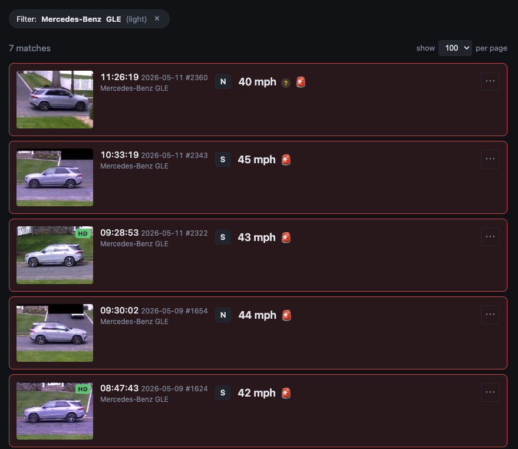

**TL;DR.** On the MacBook Air, camwatch couldn't run YOLO detection on the camera's full-resolution main stream in real time, so it detected on a low-resolution substream and used a fragile cross-stream lookup to upgrade the thumbnail to HD, hitting only about 60% success in practice. Moving the service to an Ubuntu desktop with an RTX 3060 lets yolo11(large) run directly on the main stream. The biggest practical payoff: every trigger now ships with a reliably high-resolution thumbnail, which made per-pass vehicle make/model/color identification and a "filter by this vehicle" view in the UI possible for the first time.

[The first camwatch post](/blog/camwatch/) covered building the service end-to-end on a MacBook Air. [The second](/blog/camwatch-2/) rewrote the speed engine. This one removes the hardware bottleneck: a simpler pipeline, and new features the laptop couldn't support.

## What the MacBook Air was actually doing

The original architecture was shaped, more than anything, by what the laptop could physically keep up with. Detection ran on the 640×480 substream at a clean 15 fps. The 2048×1536 main stream was pulled in parallel, but the laptop topped out around 4 fps on it through software decode, and the service was configured at 2 fps to leave headroom. That was enough to occasionally pluck a high-res thumbnail at a trigger moment and nothing more.

Two streams, two PTS clocks, both anchored separately to wall time. To get a high-res thumbnail of the car that fired a trigger on the substream, the service had to translate substream-PTS to main-stream-PTS, then look up the matching frame in a 30-second ring buffer of main frames. The translation offset itself came from OCR'ing the camera's burned-in timestamp on a frame from each stream at startup, since that's the one wall-clock value both streams share.

That's the entire cross-stream sync rabbit hole from the original post: a TimestampedFrameBuffer class, the PTS-anchored-to-monotonic logic in capture.py, the thumb_upgrader.py worker, and the cv2.matchTemplate digit recognizer. It works. It's also a non-trivial fraction of the code, and every piece of it exists only because the MacBook Air couldn't handle YOLO detection on the main stream at full rate.

## The spare desktop

I wasn't going to buy a Mac mini for this. I happened to have an Ubuntu desktop with an RTX 3060 sitting idle on the same network, and the marginal cost of trying was an evening.

Before committing to a model size, I had Claude Code benchmark all five YOLO11 sizes against the actual main-stream JPEG, in both track-mode (with BoT-SORT, the production path) and predict-only mode.

| weights | track | predict | VRAM |
|---|---:|---:|---:|
| yolo11(nano)    | 43 fps · 23 ms | 162 fps ·  6 ms |  65 MiB |
| yolo11(small)   | 42 fps · 24 ms | 152 fps ·  7 ms | 109 MiB |
| yolo11(medium)  | 36 fps · 28 ms |  98 fps · 10 ms | 185 MiB |
| yolo11(large)   | 34 fps · 29 ms |  79 fps · 13 ms | 211 MiB |
| yolo11(x-large) | 27 fps · 38 ms |  47 fps · 21 ms | 392 MiB |

Two things stood out. First, every size cleared the 20 fps camera rate with headroom, and VRAM never crossed 5% of the 8 GB card. Second, nano and small are essentially tied in track-mode (43 vs 42 fps): BoT-SORT's CPU-bound Hungarian matching dominates the per-frame cost at those sizes, so the GPU model size barely registers until medium and up.

After the cutover, I swapped yolo11(nano) for yolo11(large). It's the sweet spot in the table: a real accuracy jump on small or distant vehicles, still 1.7× headroom over the camera's frame rate, and 211 MiB of VRAM out of 8 GB.

## The simpler pipeline

The pipeline before:

```
sub stream  (640×480, 15 fps)
  -> YOLO + BoT-SORT
      -> trigger events
      -> low-res thumbnail

main stream (2048×1536, ~2 fps)
  -> ring buffer keyed by PTS
  -> thumb upgrader (cross-stream PTS lookup)
      -> high-res thumbnail (~60% success in practice)
```

And after:

```
main stream (2048×1536, ~15 fps)
  -> YOLO + BoT-SORT
      -> trigger events
      -> current frame = thumbnail
      -> clip recorder
```

One stream in, one time domain. The "thumbnail" is just whichever main-stream frame was current when the trigger fired. No PTS hunting, no cross-stream offset, no OCR. The bug class that took most of the first build to chase, the one responsible for the "I knew the speed reading was wrong" detour in the original post, is now structurally impossible.

## Stream throughput

Same camera, same calibration, same workload. Daytime hours, averaged across the metrics tables on each host.


The architectural story shows up directly. On the Mac side, sub fps holds at 15 and yolo fps tracks it (detection running on the substream), while main fps trickles along at ~3 fps (the throttled thumbnail path). On the 3060 side, the substream is gone, and main fps now runs at the camera's full rate. YOLO fps sits right on top of main fps, because detection is running on those same frames.

## Inference latency


This is the panel worth dwelling on. The Mac's inference times sit in a wide, noisy band: p50 around 26 ms, p95 around 41 ms, with frequent excursions and occasional spikes past 100 ms. The 3060 runs tighter and quieter: p50 about 32 ms, p95 about 36 ms, the two lines almost on top of each other. The p50 actually went up a hair, because we're now running yolo11(large) on a 2048×1536 frame (about 3.1 MP) instead of yolo11(nano) on a 640×480 frame (about 0.3 MP). Larger model, roughly 10× the pixels, and the variance still collapsed. The p95 going down at the same time is the practically useful number: no more occasional stalls.

## Reliable HD, then automated vehicle enrichment

The dual-stream pipeline didn't always succeed at upgrading a thumbnail to HD. About 40% of Mac-era passes ended up with the substream image because the cross-stream lookup couldn't find a matching main frame within tolerance. The new single-stream pipeline makes that question disappear: the trigger frame is the HD frame, by construction.


A side-by-side from the database: the Mac-era pass fell back to the substream thumb (640 × 480) while the 3060-era pass keeps the full main-stream frame (2048 × 1536). Same car make, same direction, same approximate speed.

Once HD was reliable, the next feature was obvious: identify what was driving past. The HD thumb is sharp enough that a vision model can read make, model, color, and year-range off the body in a single query. I added a handful of vehicle metadata columns to the passes table, then asked Claude (in an interactive session) to walk the table of unenriched passes (290 at the time), read each thumbnail, and write the result back.

Twenty minutes in, token usage felt off. The structure of the bug, once you see it, is obvious: every tool result stays in the conversation for the rest of the session. So thumbnail #200 isn't read once. By the time turn 200 runs, thumbnails #1 through #199 are still in context. Cache reads compound. The prompt grows linearly with passes processed; the cache-read fee grows linearly with prompt size; total cost grows quadratically with passes in one session. A token black-hole, hidden behind the comforting word "cached."

| Metric | Value |
|---|---|
| Max single-turn context | **857 K tokens** (1 M ceiling) |
| Total cached tokens read | **659 M** |
| Cost-equivalent at Opus rates | ~$200 to $350 per 290-row run |

The shipping workaround is headless Claude on a cron schedule. Every hour, a small launcher script spawns a fresh `claude -p` session, points it at a spec file, and exits when the session does. The spec tells the session to read recent service health, then query the DB for newly captured passes with no enrichment, batch them through sub-agents that handle the actual image reads, pipe the resulting JSON to a small `enrich_apply.py` script that does the DB writes, and stop.

Nothing persists across ticks except a small status file the session writes at the end. The naive loop's failure mode (context growing without bound) is structurally absent when every tick starts at zero. New passes from the last hour get enriched in the next tick. The Max-plan budget that one naive interactive run almost emptied now covers months of background enrichment.

## Filtering by vehicle

With make, model, and color on every pass, the UI gets a one-click "filter by this vehicle" action. The list collapses to every prior pass that matches the same vehicle. Color match is fuzzy via a small lookup (silver, light-grey, off-white all bucket into "light"), so lighting drift across days does not split one repeat offender into three.



Above: the list filtered to "Mercedes-Benz GLE (light)". Seven matches over the last few days, ranging 40 to 45 mph, all flagged as exceeding the 40 mph alert threshold. This is what the architecture change was really for: not faster YOLO, not cleaner code per se, but the question "is this a repeat offender?" being one click away.

## Takeaways

1. **Hardware selection is a software-design decision.** Some architectural complexity isn't an interesting design choice. It's the shadow that constrained hardware casts onto your codebase. The cross-stream sync wasn't a feature, it was a workaround for a laptop that couldn't keep up. When the workaround is bigger than the original problem, the cheapest fix is sometimes a different piece of hardware. Engineers tend to think of hardware as fixed and software as the variable. Sometimes flipping that is the right move.

2. **Naive agentic loops have hidden quadratic cost.** Tool results stay in the conversation for the rest of the session, so by row 290 the agent has re-read the first thumbnail 289 times via the cache. Resetting context every iteration (a fresh headless session per tick) is a reliable workaround.

---

Code: [github.com/leochen4891/camwatch](https://github.com/leochen4891/camwatch)
