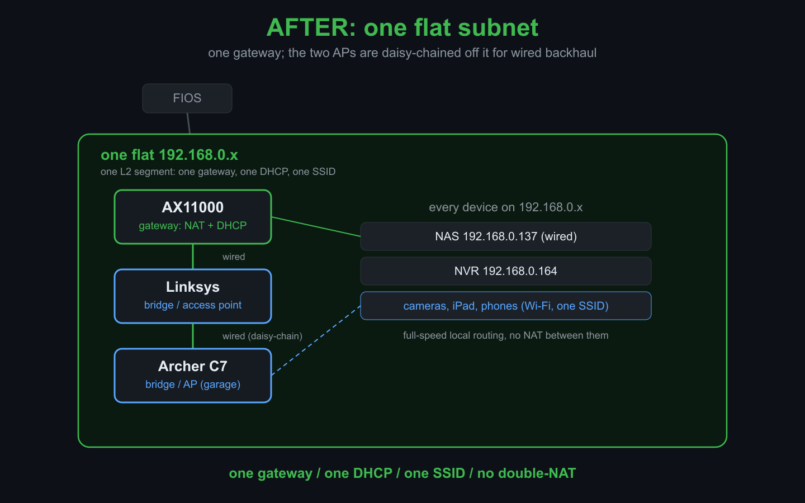

**TL;DR.** My new NAS (a home file server) had a gigabit Ethernet wire, but whenever a device on the main network read from it the traffic went over the NAS's Wi-Fi instead. The culprit was a second router quietly running its own NAT (the address-translation a router is meant to do just once, at the edge of your network), which split the house into two subnets (two separate address ranges) and stranded the NAS's wire on a side nothing else could reach. Flattening it to one subnet fixed the speed and snowballed into a full Wi-Fi rebuild.



## The NAS that ignored its own wire

The job started small. Turn an old Dell box, `lei-ubuntu`, into a NAS: Samba share, FTP for camera uploads.

Then one question broke it open. If my MacBook is on the `192.168.0.x` network and reads a file from the NAS, does that traffic go over the NAS's gigabit Ethernet or its Wi-Fi?

The answer was Wi-Fi, and there was no way to make it use the wire. The NAS had two interfaces on two different networks:

```
eno1   (wired)  192.168.1.137   gateway 192.168.1.1   ← default route, gigabit
wlp5s0 (wifi)   192.168.0.137   gateway 192.168.0.1
```

A client can only reach the NAS at the IP that lives on the client's own subnet. My MacBook on `192.168.0.x` could only ever talk to `192.168.0.137`, which is the NAS's Wi-Fi interface. The gigabit wire was on `192.168.1.x`, a network my MacBook could not route to at all. So the fast path existed, was plugged in, was idle, and was unreachable. That single fact, fast wire present but unusable, was the symptom that named the real problem: the house had two networks where it should have had one.

## Two networks, one of them in disguise

The topology, once drawn out:

```
FIOS ──→ TP-Link AX11000      192.168.0.x, gateway .1   (the real edge router)
         │
         └── Ethernet ──→ Linksys EA9300   192.168.1.x, gateway .1   (a SECOND NAT router)
                          └── the NAS's wired port lived back here
```

The tell that the Linksys was routing rather than bridging: the NAS's wired port had been handed `192.168.1.137` behind it, a whole separate subnet NAT'd inside the `192.168.0.x` one. A classic double-NAT.

It is worth pulling apart the two things the Linksys was doing here, because I had them conflated for longer than I should have. It created a second **subnet** (just an address range, harmless by itself), and it **NAT'd** that subnet behind the AX (network address translation, a second layer of it, which is the part that does the harm). The NAT is what walls the `192.168.1.x` devices into an island the rest of the house cannot route back into. A consumer router in router mode bundles both at once, so what feels like "adding a switch" silently forks the network. Bridge mode, later, removes both in one move: no new subnet, no second NAT, just a plain switch on the existing network.

The surprise was which side held the devices. The `192.168.1.x` network was not a stale leftover. It was the **main** network: about 17 things lived back there, an iPad, a MyQ garage door, a Rachio sprinkler controller, a couple of Yamaha receivers, smart plugs, a camera, and the NAS. MAC-vendor lookups turned the cryptic router-table names into a real inventory, including one device that announced itself like a Yamaha receiver but resolved to a Chamberlain garage-opener MAC. Device names lie; MACs do not.

## Flattening it

Before touching a cable I talked the whole situation through with Claude, two subnets and three aging routers and a pile of devices, and we settled on the target (one flat `192.168.0.x` network, a single DHCP server, which is the one service that hands out addresses, the other two routers demoted to bridged access points) and a safe order to get there. The fix itself is conceptually trivial and operationally fiddly: put the Linksys in bridge mode (so it stops routing and becomes a plain Wi-Fi access point, passing traffic straight through instead of making its own network), move everything onto the one `192.168.0.x` network behind the AX11000, and move the NAS cable last.

After flipping the Linksys to bridge mode the wired side looked unchanged, still `192.168.1.137`. That was a head-fake. Bridge mode had taken effect (the old `192.168.1.1` gateway now showed FAILED); the NAS was just holding a stale DHCP lease (still clinging to the address it had been given earlier). A forced renew on `eno1` settled it:

```
eno1 inet 192.168.0.184/24
default via 192.168.0.1 dev eno1 metric 100   ← wired is now the primary path
```

The double-NAT was gone, the `192.168.1.x` subnet ceased to exist, and the MacBook could finally reach the NAS over the wire. The NAS later landed on a clean static `192.168.0.137`.

## The thing that breaks when a subnet disappears

Collapsing the second subnet had a casualty: the Reolink NVR (the box that records the security cameras) vanished from the network.

It had not crashed. It was sitting at a **static** `192.168.1.114`, and when `192.168.1.x` stopped existing, the NVR was physically connected but logically marooned: no gateway, no app, no internet, on an address that pointed nowhere. Recovering it took two tries. First the remote route: its ONVIF API can reconfigure the network without touching the box, but every authenticated call came back empty. The unit answered unauthenticated ONVIF, so I knew it was alive, but earlier wrong-password attempts had tripped its brute-force lockout and it silently dropped every authenticated request. The web UI was out too (a 2018 unit needing an old NPAPI plugin modern Chrome won't run), and the on-screen console would not take my USB mouse. So I went physical: a monitor into the NVR's HDMI, and the unit's own front-panel buttons to clear the stale static `192.168.1.x` address, pick DHCP, and force a renew. It came up on `192.168.0.164`, back on the flat network.

This is the first place the throughline showed up. A change in one room (a router's mode) took down a device in another room (the NVR) for a reason that lived in a third place entirely (a static IP someone set years ago). Nothing about the symptom pointed at the cause.

## The access point that had been off the whole time

Somewhere in here came a throwaway question: we have routers all broadcasting the same Wi-Fi name, can we see that? Which is when I remembered there was a **third** one, a TP-Link Archer C7, that had been on the LAN with both radios off. Reviving it produced the cleanest cautionary tale of the project.

At one point its uplink went into the C7's **WAN** port instead of a LAN port. That single cable turned the access point back into a NAT router. Its WAN grabbed `192.168.0.207`, and because its WAN and LAN were now both on `192.168.0.x`, the C7 relocated its own management address to `192.168.1.1` to escape the collision, which is exactly why its admin page later lived off in a corner of address space nobody could reach. The rule, learned the hard way: in access-point mode the uplink goes in a LAN port and the WAN port stays empty.

The C7 then went out to the garage, the far corner of the house, to give the road-facing camera a strong nearby signal. And here the AI ran into a wall it could not climb: the NAS sits too far from the garage to hear that AP over the air at all. It could confirm the C7 was bridged and not double-NAT'ing, but the actual radio coverage was something only a human walking to the garage with a phone could verify. The reasoning was the easy part; being in two places at once was the hard part.

## Wi-Fi, where the tools have quietly disappeared

The last act was confirming all three radios and giving them a channel plan. I carried the MacBook to the center of the house to scan, and discovered modern macOS has closed every door the old playbook used:

- `airport -s`, the command every Wi-Fi guide still references, was removed in macOS 14.4. This machine runs 26.5.
- `system_profiler` reports nearby networks but redacts their names and gives no BSSIDs (each radio's unique hardware fingerprint, as opposed to the shared Wi-Fi name), useless for telling apart three radios that share one name.
- A Swift CoreWLAN scan returns names but `nil` BSSIDs, because BSSID is gated behind a Location Services entitlement that an unsigned script cannot hold. I even built a tiny signed app to get the entitlement; it got the location grant and still would not surface BSSIDs, because an ad-hoc signature does not clear the gate.

The tool that actually works was sitting in the OS the whole time: Wireless Diagnostics, with its hidden Scan window. It is Apple-signed, so it shows every BSSID, channel, and signal with no fuss. That is the modern replacement for `airport`, and nobody tells you.

## The channel plan, and a fact about 80 MHz nobody mentions

With real scans I could see all three radios colliding, all on Auto, all piling onto 5 GHz channel 36. Wi-Fi channels are like radio-station frequencies: two access points within range of each other on the same channel talk over one another, so the goal is to keep neighbors on different ones. By now the layout was one router (the AX11000) and two bridged access points (the Linksys and the C7), all three broadcasting the same name. Their placement turned out to be a triangle, with the AX and C7 at the far points and the Linksys in the middle, which makes the plan natural: the two distant radios can reuse a channel because they cannot hear each other, and the middle one gets its own.

On 2.4 GHz that is the familiar 1 / 6 / 11. On 5 GHz I hit a constraint I had never had spelled out: at 80 MHz width (a wider, faster channel), the US has only two non-DFS lanes (channels free of the radar-avoidance rules that make the others briefly cut out): the `{36-48}` block and the `{149-161}` block. That is it. Two lanes. Channels 149, 157, and 161 are not three options, they are one lane. So the AX and C7 share the lower lane (reuse, since they are far apart), the Linksys sits alone on the upper lane, and the spare 5 GHz radios that had nowhere non-overlapping to go got switched off. Match the radio count to the lanes, or accept DFS; there is no third option at 80 MHz.

## Did it work

The proof I cared about was the road camera. After the C7 went up in the garage, I checked the NAS upload directory: clips were landing in `camera-by-road/` every 1 to 2 minutes, the most recent one 25 seconds old. The camera had reconnected over its new strong signal and was uploading in real time over the now-fast wired path to the NAS.

End state: one flat `192.168.0.0/24` network, a single gateway, two bridged access points, no double-NAT, one Wi-Fi name everywhere, static collision-free channels, the NVR back, and the camera streaming.

## What I took away

Three moves I will reuse, in the order they will be useful to someone else.

**1. Plan the target with Claude before touching a cable.** I started from a genuinely messy inventory: two subnets, three aging routers, a NAS, an NVR, a handful of cameras, and no clear picture of what belonged where. The most valuable step was not any single fix, it was talking the current state through with Claude and coming out with a target (one flat subnet, one DHCP server, two routers demoted to bridged access points) and a safe order of operations to reach it without taking the live network down. The work split cleanly from there: Claude held the whole topology in its head and reasoned about state, while I was its eyes and hands moving cables and walking to the garage. Two sessions on two machines a day apart never lost the thread, because one handover doc carried the map between them.

**2. A temporary second IP reaches a device stranded on a dead subnet.** The C7's admin page had drifted to `192.168.1.1` (the WAN-port mishap), a subnet my MacBook on `192.168.0.x` could not route to, so the login page would not even load. No factory reset needed: adding a throwaway alias on that subnet to my own machine was enough to reach the admin page, move its address back onto the flat subnet, and remove the alias:

```bash
# macOS
sudo ifconfig en0 alias 192.168.1.250 255.255.255.0
# now reach the C7 admin at 192.168.1.1, then move its LAN IP onto 192.168.0.x
sudo ifconfig en0 -alias 192.168.1.250
# Linux: sudo ip addr add 192.168.1.250/24 dev eno1   (use 'del' to undo)
```

That turned a "the page won't even load" dead end into a two-minute fix.

**3. Scan the air to verify Wi-Fi, do not trust the settings page.** A router's config page shows what you asked for, not what is actually broadcasting, and with three radios sharing one name the pages cannot tell you whether they are colliding. A scan can: it shows each AP's real BSSID, channel, and signal, which is how I confirmed all three sat on their intended channels and were not stacked on the same one. Verify Wi-Fi by observation, not by assuming the save button took.

The quiet lesson under all three: a network that "works", routes traffic, serves DHCP, reaches the internet, can still be quietly wrong. Mine looked completely healthy right up until I measured one file copy, and then the whole thing unraveled.
